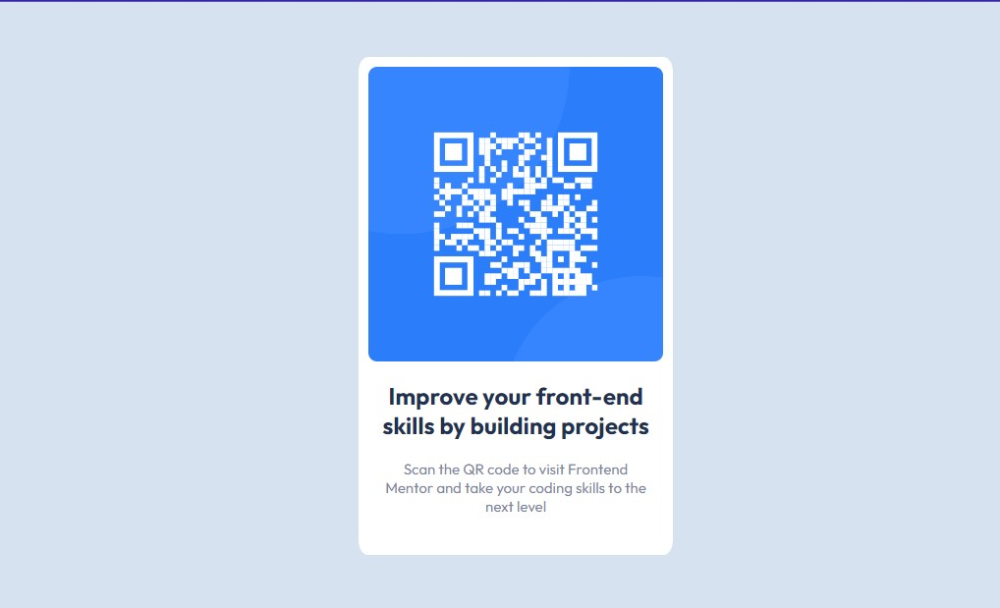
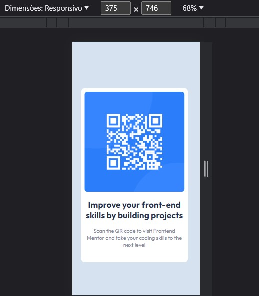

# Frontend Mentor - QR code component solution

## Bem-vindo! 👋

- Essa e a resolução do projeto [QR code component solution]
- Que se encontra no seguite site: (https://www.frontendmentor.io/challenges/qr-code-component-iux_sIO_H).
- Os desafios do Frontend Mentor ajudam você a melhorar suas habilidades de codificação através da construção de projetos realistas.

## Objetivos 🎯

- Construir um layout de cartão QR-code.
- Utilização de estilos CSS e Flexbox.
- utilizando HTML e CSS.

## Screenshots

### Desktop

### Mobile

### Link do site

https://davison-silva.github.io/Projeto-QR-code-component-frontend-mentor/

## Processo

### Construção do projeto

<ol>
<li>HTML tags semânticas</li>
<li>CSS</li>
<li>Flexbox</li>
</ol>

### Aprendizado 🚀

Consegui colocar em prática os estudos de HTML e CSS, onde utilizei diversas tags. Aprimorei meu conhecimento em CSS, empregando flexbox e estilizando textos e imagem.

### Projeto finalizado ⏳

Como este projeto era simples, não tenho planos de continuar com ele. No entanto, ele me ajudou a aplicar as habilidades que venho estudando em HTML e CSS.

### Autor

- GitHub - [Davison Silva] https://github.com/davison-silva
- Frontend Mentor - https://www.frontendmentor.io/profile/davison-silva
- E-mail - davisonsnascimento@gmail.com